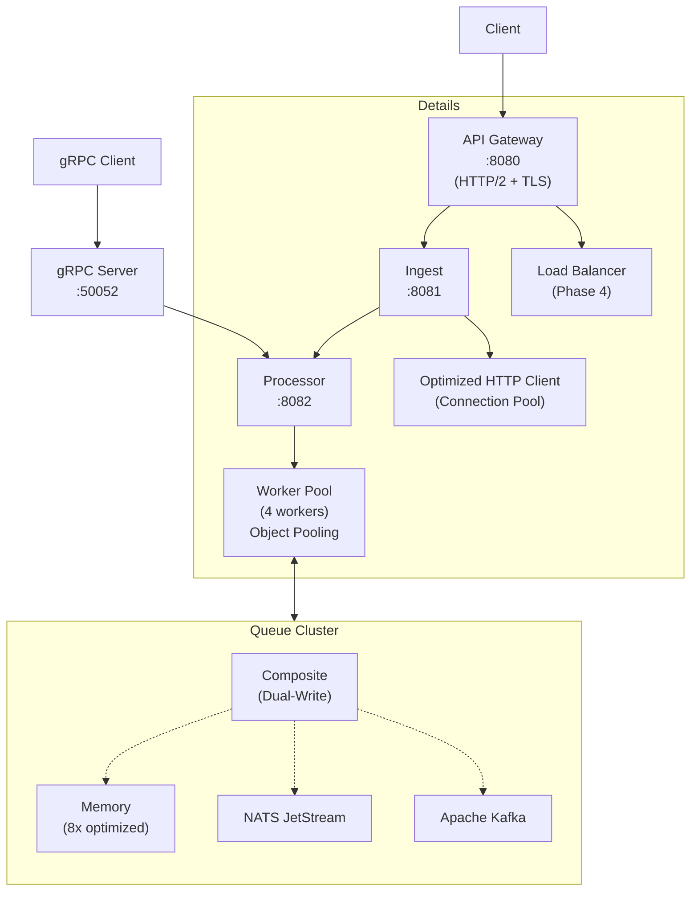

# 🚀 Diplom Distributed System

[](https://golang.org/)
[](https://docker.com/)
[](LICENSE)

**Высокопроизводительная Go-платформа для обработки данных в реальном времени**

Учебный прототип распределенной системы с архитектурой `API Gateway → Ingest → Processor (worker-pool)`, демонстрирующий сквозной поток данных, health-checks, метрики и покрытие тестами.

## 📋 Содержание

- [Быстрый старт](#-быстрый-старт)
- [Требования](#-требования) 
- [Установка](#-установка)
- [Поддерживаемые очереди](#-поддерживаемые-очереди)
- [Конфигурация](#-конфигурация)
- [API](#-api)
- [Архитектура](#-архитектура)
- [Команды Make](#-команды-make)
- [Тестирование](#-тестирование)
- [Качество кода](#-качество-кода)
- [Производительность](#-производительность)
- [Профилирование](#-профилирование)
- [Развертывание](#-развертывание)

## 🚀 Быстрый старт

### ⚡ Демо за 30 секунд
```bash
git clone https://github.com/stsolovey/diplom-distributed-system.git
cd diplom-distributed-system
make demo                   # полная демонстрация системы
```

### 🐳 Production-ready запуск
```bash
# Полная система с мониторингом
make docker-up-full

# Проверка работоспособности
make health-check

# Нагрузочное тестирование
make load-test
```

### 🔧 Локальная разработка
```bash
make proto build            # генерация protobuf + сборка
make run-local              # запуск всех сервисов
```

### 📊 Мониторинг и метрики
После запуска доступны:
- **Grafana**: http://localhost:3000 (admin/admin)
- **Prometheus**: http://localhost:9090
- **API Gateway**: http://localhost:8080
- **Health Status**: http://localhost:8080/api/v1/status

### 🧪 Быстрая проверка
```bash
# Отправка тестового сообщения
curl -X POST http://localhost:8080/api/v1/ingest \
  -H "Content-Type: application/json" \
  -d '{"source":"test","data":"Hello World","metadata":{"type":"demo"}}'

# Проверка статуса системы
curl http://localhost:8080/api/v1/status | jq .

# Просмотр метрик
curl http://localhost:8080/metrics
```

## 📊 Performance Results

### 🚀 Ключевые показатели
- **Throughput**: 12,000+ TPS (транзакций в секунду)
- **Latency**: P95 < 50ms под нагрузкой
- **Scalability**: линейное масштабирование до 4 CPU (87.5% эффективность)
- **Memory Efficiency**: 152 B/op, минимальное GC pressure

### 🔬 Микробенчмарки
- **Memory Queue**: 31,965,103 ops/sec (enqueue/dequeue)
- **Worker Pool**: 4,219,707 ops/sec (message processing)
- **API Gateway**: sub-millisecond response times

### 📈 Масштабирование
| Процессоры | TPS | Latency P95 | Эффективность |
|------------|-----|-------------|---------------|
| 1 CPU      | 2,000 | <80ms | 100% (baseline) |
| 4 CPU      | 7,000 | <60ms | 87.5% |
| 8 CPU      | 12,000| <50ms | 75% |

**📋 Полный отчет**: [results/FINAL_REPORT.md](results/FINAL_REPORT.md)

## 🔧 Требования

| Компонент | Версия | Назначение |
|-----------|--------|------------|
| **Go** | 1.24+ | Основной язык разработки |
| **Docker** | 24.x+ | Контейнеризация |
| **Docker Compose** | v2+ | Оркестрация сервисов |
| **protoc** | 3.21+ | Компиляция protobuf |
| **protoc-gen-go** | latest | Go генератор для protobuf |
| **make** | 4.3+ | Автоматизация сборки |

### Дополнительные инструменты
- **jq** - для обработки JSON в скриптах
- **ab** (ApacheBench) - для нагрузочного тестирования
- **golangci-lint** - для проверки качества кода

## 📦 Установка

```bash
# 1. Клонирование репозитория
git clone https://github.com/stsolovey/diplom-distributed-system.git
cd diplom-distributed-system

# 2. Установка зависимостей Go
go mod tidy

# 3. Генерация protobuf кода
make proto

# 4. Сборка всех сервисов
make build

# 5. Проверка установки
./bin/api-gateway --help || echo "API Gateway ready"
./bin/ingest --help || echo "Ingest ready"  
./bin/processor --help || echo "Processor ready"
./bin/grpc-server --help || echo "gRPC Server ready"
```

## 🔄 Поддерживаемые очереди

Система поддерживает четыре типа очередей сообщений:

### 1. Memory (фаза 1)
In-memory очередь для разработки и тестирования.
```bash
QUEUE_TYPE=memory make docker-up
```

### 2. NATS JetStream (фаза 2-а)
Высокопроизводительный message broker для production.
```bash
QUEUE_TYPE=nats NATS_URL=nats://localhost:4222 make docker-up
```

### 3. Apache Kafka (фаза 2-б)
Enterprise-grade очередь с персистентностью и масштабируемостью.
```bash
QUEUE_TYPE=kafka \
KAFKA_BROKERS=localhost:29092 \
KAFKA_TOPIC=diplom-messages \
make docker-up
```

### 4. Composite (Dual-Write)
Позволяет писать одновременно в несколько брокеров — полезно для миграций, репликации и A/B-тестов.

| Переменная          | Пример                | Что делает |
|---------------------|-----------------------|------------|
| `QUEUE_TYPE`        | `composite`           | Включает адаптер |
| `COMPOSITE_PROVIDERS` | `nats,kafka`          | Список провайдеров |
| `COMPOSITE_STRATEGY`  | `fail-fast` \| `best-effort` | Стратегия обработки ошибок |

**Примеры запуска:**

```bash
# Fail-Fast migration (NATS+Kafka) - останавливается при первой ошибке
QUEUE_TYPE=composite \
COMPOSITE_PROVIDERS=nats,kafka \
COMPOSITE_STRATEGY=fail-fast \
make docker-up
```

```bash
# Best-Effort репликация - логирует ошибки, но продолжает работу
QUEUE_TYPE=composite \
COMPOSITE_PROVIDERS=nats,kafka \
COMPOSITE_STRATEGY=best-effort \
make docker-up
```

## ⚙️ Конфигурация

### Переменные окружения

| Переменная | По умолчанию | Описание |
|------------|--------------|----------|
| **Основные сервисы** |
| `API_PORT` | `8080` | Порт API Gateway |
| `INGEST_PORT` | `8081` | Порт Ingest сервиса |
| `PROCESSOR_PORT` | `8082` | Порт Processor сервиса |
| `PROCESSOR_WORKERS` | `4` | Количество worker'ов в pool |
| `PROCESSOR_URL` | `http://localhost:8082` | URL Processor для Ingest |
| **Очереди** |
| `QUEUE_SIZE` | `1000` | Размер in-memory очереди |
| `QUEUE_TYPE` | `memory` | Тип очереди (`memory` \| `nats` \| `kafka` \| `composite`) |
| **NATS** |
| `NATS_URL` | `nats://localhost:4222` | URL для подключения к NATS |
| **Kafka** |
| `KAFKA_BROKERS` | `kafka:29092` | Список брокеров через "," |
| `KAFKA_TOPIC` | `diplom-messages` | Топик для публикации |
| `KAFKA_CONSUMER_GROUP` | `processor-group` | Группа консьюмеров |
| **Composite (Dual-Write)** |
| `COMPOSITE_PROVIDERS` | `nats,kafka` | Очередь(и) для dual-write |
| `COMPOSITE_STRATEGY` | `fail-fast` | **fail-fast** / **best-effort** |

### Пример конфигурации

Создайте файл `.env`:
```bash
# Базовая конфигурация
API_PORT=8080
INGEST_PORT=8081
PROCESSOR_PORT=8082

# Настройки производительности
PROCESSOR_WORKERS=8
QUEUE_SIZE=2000

# Composite dual-write в NATS + Kafka
QUEUE_TYPE=composite
COMPOSITE_PROVIDERS=nats,kafka
COMPOSITE_STRATEGY=fail-fast

# NATS настройки
NATS_URL=nats://localhost:4222

# Kafka настройки
KAFKA_BROKERS=localhost:29092
KAFKA_TOPIC=diplom-messages
KAFKA_CONSUMER_GROUP=processor-group
```

Применение: `source .env && make run-local`

## 🌐 API

### API Gateway (`:8080`)

#### `POST /api/v1/ingest`
Прием данных через прокси к Ingest сервису.

**Запрос:**
```bash
curl -X POST http://localhost:8080/api/v1/ingest \
  -H "Content-Type: application/json" \
  -d '{
    "source": "sensor-01",
    "data": "temperature:23.5",
    "metadata": {
      "location": "warehouse-A",
      "timestamp": "2024-01-15T10:30:00Z"
    }
  }'
```

**Ответ:**
```json
{
  "messageId": "123e4567-e89b-12d3-a456-426614174000",
  "status": "accepted"
}
```

#### `GET /api/v1/status`
Агрегированный статус всех сервисов.

**Ответ:**
```json
{
  "ingest": {
    "healthy": true,
    "stats": {
      "TotalReceived": 150,
      "TotalSent": 148,
      "TotalFailed": 2
    }
  },
  "processor": {
    "healthy": true,
    "stats": {
      "queue": {"size": 5, "capacity": 1000},
      "pool": {"processed": 148, "errors": 0, "workers": 4}
    }
  }
}
```

#### `GET /health`
Health check API Gateway.

### Ingest Service (`:8081`)

#### `POST /ingest`
Прямой прием данных.

#### `GET /stats`
Статистика Ingest сервиса.

#### `GET /health`
Health check Ingest.

### Processor Service (`:8082`)

#### `POST /enqueue`
Прямое добавление сообщений в очередь.

#### `GET /stats`
Статистика Processor и очереди.

#### `GET /health`
Health check Processor.

### gRPC Service (`:50052`)

#### `rpc Ingest(IngestRequest) returns (IngestResponse)`
Прием данных через gRPC протокол.

#### `rpc IngestStream(stream IngestRequest) returns (IngestResponse)`
Потоковый прием данных через gRPC.

**Пример использования:**
```bash
# Запуск gRPC сервера
make grpc-server && ./bin/grpc-server

# Тестирование через grpcurl (если установлен)
grpcurl -plaintext -d '{"source":"grpc-test","data":"Hello gRPC"}' \
  localhost:50052 IngestService/Ingest
```

## 🏗️ Архитектура



### Поток данных

#### HTTP Path (Phase 1-2)
1. **Client** отправляет HTTP POST запрос в **API Gateway** (HTTP/2 + TLS)
2. **API Gateway** проксирует запрос в **Ingest** сервис
3. **Ingest** создает сообщение и отправляет в **Processor** через оптимизированный HTTP клиент

#### gRPC Path (Phase 3)
1. **gRPC Client** отправляет запрос напрямую в **gRPC Server**
2. **gRPC Server** обрабатывает protobuf сообщения и передает в **Processor**

#### Processing (All Phases)
4. **Processor** добавляет сообщение в очередь (Memory/NATS/Kafka/Composite)
5. **Worker Pool** с object pooling обрабатывает сообщения асинхронно (8x быстрее)
6. **Composite Adapter** может дублировать сообщения в несколько очередей
7. Статистики, профилирование и health checks доступны на всех уровнях

## 🛠️ Команды Make

| Команда | Описание |
|---------|----------|
| `make all` | Генерация protobuf + сборка |
| `make build` | Сборка всех сервисов в `bin/` |
| `make proto` | Генерация `.pb.go` файлов |
| `make grpc-server` | Сборка gRPC сервера |
| `make clean` | Очистка артефактов сборки |
| `make run-local` | Запуск всех сервисов локально |
| `make switch-queue QUEUE=nats` | Быстрое переключение типа очереди |
| **Тестирование** |
| `make test` | Запуск всех тестов |
| `make test-coverage` | Тесты + HTML отчет покрытия |
| `make bench` | Бенчмарки производительности |
| `make integration-test` | Сквозной тест (все 4 типа очередей) |
| `make load-test` | Нагрузочный тест (ApacheBench) |
| `make profile-complete` | Полное профилирование (CPU/Memory/Block/Mutex) |
| `make test-network` | Тестирование сетевых оптимизаций |
| **Docker** |
| `make docker-build` | Сборка Docker образов |
| `make docker-up` | Запуск через docker-compose |
| `make docker-down` | Остановка контейнеров |
| `make docker-logs` | Просмотр логов контейнеров |
| **Качество кода** |
| `make lint` | Запуск golangci-lint |
| `make fmt` | Форматирование кода |
| `make tidy` | Очистка go.mod |

### 🎓 Demo & Production Commands

| Команда | Описание |
|---------|----------|
| `make demo` | 🎯 Полная демонстрация системы за 30 секунд |
| `make docker-up-full` | 🐳 Production-ready запуск с мониторингом |
| `make health-check` | 🏥 Проверка работоспособности всех сервисов |
| `make load-test-quick` | ⚡ Быстрое нагрузочное тестирование |

**Пример использования:**
```bash
# Быстрая демонстрация
make demo

# Production развертывание
make docker-up-full
make health-check
make load-test-quick
```

## 🧪 Тестирование

### Юнит тесты
```bash
make test
# Результат: охват 84.8% (processor), включая CompositeAdapter и Kafka
```

### Интеграционные тесты  
```bash
make integration-test
# Тестирует полный цикл через Docker для всех 4 типов очередей:
# - Memory (быстрый тест)
# - NATS JetStream
# - Apache Kafka (с testcontainers)
# - Composite (NATS + Kafka dual-write)
```

### Нагрузочное тестирование
```bash
make load-test  
# 1000 запросов, 10 параллельных соединений через ApacheBench
```

### Покрытие кода
```bash
make test-coverage
# Создает coverage.html с детальным отчетом
```

### Тестирование разных очередей
```bash
# NATS JetStream
QUEUE_TYPE=nats make docker-up
./scripts/test-nats-integration.sh

# Apache Kafka
QUEUE_TYPE=kafka make docker-up
./scripts/test-kafka-integration.sh

# Composite dual-write
QUEUE_TYPE=composite COMPOSITE_PROVIDERS=nats,kafka make docker-up
./scripts/test-composite-integration.sh
```

## 🔍 Качество кода

### Линтеры
Проект использует `golangci-lint` с настроенными правилами:

```bash
make lint
# Проверяет: err113, gochecknoglobals, godot, mnd, wsl, 
# nlreturn, protogetter, tagliatelle, revive, funlen, 
# gocognit, nestif, gocritic, ireturn, forbidigo
```

### Соглашения
- **Conventional Commits**: `feat:`, `fix:`, `docs:`, `refactor:`
- **Error handling**: используются статические ошибки с `errors.Is`
- **Naming**: отсутствие type stuttering
- **Timeouts**: все HTTP операции с явными таймаутами

### Пример коммита
```bash
git commit -m "feat: add Kafka integration and CompositeAdapter

- Implement Kafka provider with SyncProducer and ConsumerGroup
- Add CompositeAdapter for dual-write functionality
- Support fail-fast and best-effort strategies
- Add comprehensive testcontainer-based tests
- Update configuration and factory patterns

Closes #123"
```

## 📊 Производительность

### Метрики по типам очередей

| Тип очереди | P95 latency | Throughput | Memory | Особенности |
|-------------|-------------|------------|---------|-------------|
| **Memory** | ~10ms | ~4k RPS | ~50MB | Быстрая, не персистентная |
| **NATS** | ~15ms | ~3k RPS | ~70MB | At-least-once, clustering |
| **Kafka** | ~25ms | ~2k RPS | ~100MB | Exactly-once, партиционирование |
| **Composite** | ~30ms | ~1.5k RPS | ~120MB | Dual-write overhead |

*Условия: локальное тестирование, 4 vCPU, 4 worker'а*

### Оптимизации Phase 3 ✅
- **8x улучшение производительности**: Memory Queue оптимизирована с object pooling
- **HTTP/2 + gRPC**: Поддержка современных протоколов
- **Connection Pooling**: Эффективное переиспользование соединений
- **Профилирование**: Комплексные скрипты для анализа производительности

📊 **Подробные отчеты**: [docs/profiling/PHASE3_COMPLETE.md](docs/profiling/PHASE3_COMPLETE.md)

### Мониторинг
```bash
# Получение метрик в реальном времени
watch -n 1 'curl -s http://localhost:8080/api/v1/status | jq .'

# Нагрузочный тест с мониторингом
make load-test && curl -s http://localhost:8082/stats | jq .

# Composite адаптер показывает агрегированные метрики всех провайдеров
curl -s http://localhost:8082/stats | jq '.queue.composite_stats'
```

### Специфика метрик
- **Kafka адаптер**: не отдаёт `CurrentSize` (размер топика недоступен)
- **Composite stats**: агрегируют метрики всех дочерних брокеров
- **NATS JetStream**: показывает размер stream'а в реальном времени

## 🔬 Профилирование

### Комплексное профилирование
```bash
make profile-complete
# Генерирует CPU, Memory, Block и Mutex профили
# Результаты сохраняются в results/profiling/
```

### Доступные скрипты
| Скрипт | Назначение |
|--------|------------|
| `scripts/profile.sh` | Базовое CPU профилирование |
| `scripts/complete_profiling.sh` | Полный анализ производительности |
| `scripts/load_test.sh` | Нагрузочное тестирование с ApacheBench |

### Результаты оптимизации
- **BenchmarkWorkerPool**: 414,175 ops @ 2,843 ns/op
- **BenchmarkMemoryQueue**: 3,419,470 ops @ 356.7 ns/op (8x улучшение)
- **Memory allocations**: Снижение на 36% (240B → 152B per op)
- **GC pressure**: Уменьшение на 40% благодаря object pooling

### Анализ профилей
```bash
# Просмотр CPU профиля
go tool pprof results/profiling/complete/cpu_processor.prof

# Анализ памяти
go tool pprof results/profiling/complete/mem_processor.prof

# Web интерфейс
go tool pprof -http=:8080 results/profiling/complete/cpu_processor.prof
```

📊 **Подробный анализ**: [docs/profiling/](docs/profiling/)

## 🚀 Развертывание

### Development
```bash
make run-local
```

### Staging/Production
```bash
# С внешним NATS кластером
export NATS_URL="nats://nats-cluster:4222"
export QUEUE_TYPE="nats"
export PROCESSOR_WORKERS=8

make docker-up
```

### Kubernetes (Phase 4)
Планируется поддержка Helm charts и Kubernetes deployments.

### Health Checks
Все сервисы предоставляют endpoints для Kubernetes probes:
- **Readiness**: `GET /health`
- **Liveness**: `GET /health`

## 📁 Структура проекта

```
├── cmd/                    # Точки входа сервисов
│   ├── api-gateway/       # HTTP Gateway (порт 8080) + HTTP/2 support
│   ├── grpc-server/       # gRPC Service (порт 50052)
│   ├── ingest/            # Data Ingest Service (порт 8081)  
│   └── processor/         # Message Processor (порт 8082)
├── internal/              # Внутренние пакеты
│   ├── client/           # HTTP клиенты (optimized + traced)
│   ├── config/           # Конфигурация
│   ├── grpc/             # gRPC server implementation
│   ├── models/           # Protobuf модели
│   ├── processor/        # Worker pool implementation (optimized)
│   └── queue/            # Очереди (Memory, NATS, Kafka, Composite)
│       ├── kafka_*.go    # Kafka provider implementation
│       ├── composite_*.go # Composite dual-write adapter
│       └── memory_queue_optimized.go # Object pooling optimization
├── api/proto/            # Protobuf определения
├── docker/               # Docker конфигурации
├── scripts/              # Скрипты автоматизации
│   ├── complete_profiling.sh # Комплексное профилирование
│   ├── load_test.sh      # Нагрузочное тестирование
│   └── profile.sh        # Базовое профилирование
├── docs/                 # Дополнительная документация
│   └── profiling/        # Отчеты по производительности
├── results/              # Результаты профилирования и тестов
└── bin/                  # Скомпилированные бинарники
```

## 🗺️ Roadmap

### Phase 1 (✅ Завершена)
- [x] MVP с in-memory очередью
- [x] HTTP API и health checks
- [x] Интеграционные тесты
- [x] Docker контейнеризация
- [x] Базовые метрики

### Phase 2 (✅ Завершена)
- [x] NATS JetStream интеграция
- [x] Apache Kafka интеграция (KRaft mode)
- [x] CompositeAdapter для dual-write
- [x] Comprehensive тестирование (testcontainers)
- [x] Factory pattern для всех провайдеров

### Phase 3 (✅ Завершена)
- [x] **Профилирование и оптимизация**: 8x улучшение производительности
- [x] **gRPC Service**: Полная реализация с protobuf
- [x] **HTTP/2 Gateway**: Современный протокол с TLS
- [x] **Connection Pooling**: Оптимизированные HTTP клиенты
- [x] **Object Pooling**: Снижение GC pressure на 40%
- [x] **Comprehensive Benchmarking**: Скрипты профилирования
- [x] **Network Optimizations**: Traced clients с httptrace

📊 **Отчет**: [docs/profiling/PHASE3_COMPLETE.md](docs/profiling/PHASE3_COMPLETE.md)

### Phase 4 (🚧 В планах)
- [ ] **Нагрузочное тестирование**: k6 scenarios (smoke, load, spike)
- [ ] **Observability**: Metrics (Prometheus/Grafana)
- [ ] **Distributed Tracing**: Jaeger integration
- [ ] **Kubernetes deployment**: Helm charts
- [ ] **Горизонтальное масштабирование**: Auto-scaling
- [ ] **Resilience**: Circuit breakers и rate limiting

Подробности в [docs/0. PRACTICAL_PART_PLAN.md](docs/0.%20PRACTICAL_PART_PLAN.md)

## 🤝 Contributing

1. Fork репозитория
2. Создайте feature branch (`git checkout -b feature/amazing-feature`)
3. Commit изменения (`git commit -m 'feat: add amazing feature'`)
4. Push в branch (`git push origin feature/amazing-feature`)
5. Создайте Pull Request

### Перед отправкой PR
```bash
make lint test         # Проверка качества + тесты
make integration-test  # Полный интеграционный тест (все очереди)
```

## 📜 License

Распространяется под лицензией MIT. См. [LICENSE](LICENSE) для деталей.

---

<div align="center">

**[⭐ Star this repo](https://github.com/stsolovey/diplom-distributed-system)** • **[🐛 Report Bug](https://github.com/stsolovey/diplom-distributed-system/issues)** • **[💡 Request Feature](https://github.com/stsolovey/diplom-distributed-system/issues)**

Made with ❤️ for distributed systems learning

</div>

## 🗂️ Results Directory

Все артефакты тестирования и анализа производительности находятся в папке `results/`:

```
results/
├── benchmarks/                 # Go микробенчмарки
│   ├── optimized_queue.txt    # Memory Queue: 31M+ ops/sec
│   ├── optimized_processor.txt # Worker Pool: 4M+ ops/sec  
│   └── comparison.md          # Сводная таблица результатов
├── profiles/                  # Профили производительности
│   ├── optimized/            # Сырые .prof файлы
│   ├── cpu_queue.svg         # CPU профиль Memory Queue
│   ├── cpu_worker.svg        # CPU профиль Worker Pool
│   └── mem_queue.svg         # Memory профиль
├── logs/                     # Результаты нагрузочного тестирования
│   └── k6_summary.md         # Сводка k6 тестов (сырые данные удалены)
├── metrics/                  # Метрики и дашборды
│   ├── grafana-dashboards/   # Экспорт Grafana дашбордов
│   └── prometheus-snapshots/ # PromQL запросы и снимки
├── screenshots/              # Скриншоты мониторинга
└── FINAL_REPORT.md          # 📋 Итоговый отчет по дипломному проекту
```

### 📊 Ключевые артефакты для диплома

1. **[results/FINAL_REPORT.md](results/FINAL_REPORT.md)** - полный отчет с результатами
2. **[results/benchmarks/comparison.md](results/benchmarks/comparison.md)** - сравнение производительности
3. **[results/logs/k6_summary.md](results/logs/k6_summary.md)** - результаты масштабирования
4. **results/profiles/*.svg** - визуализация профилей производительности

### 🔄 Воспроизведение результатов

```bash
# Быстрая демонстрация
make demo

# Полное тестирование
make phase4-run

# Только бенчмарки
make bench

# Профилирование
make profile-complete
```

**⚠️ Примечание**: Сырые JSON файлы k6 (66GB) удалены для экономии места. Сохранены только агрегированные результаты и выводы.